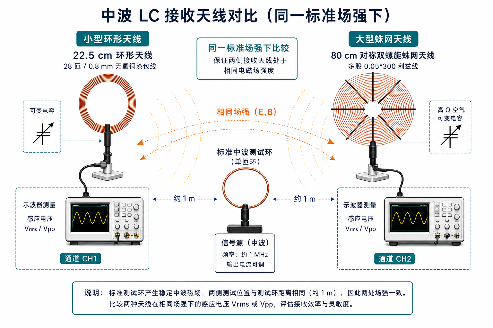
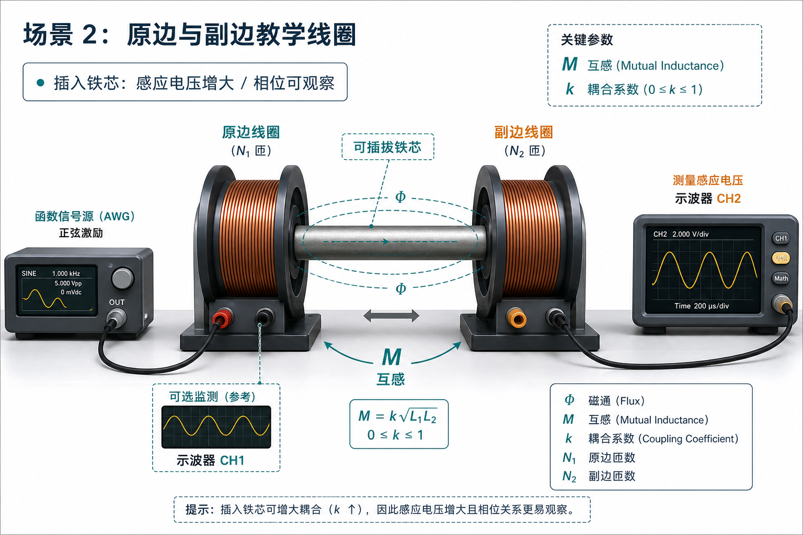
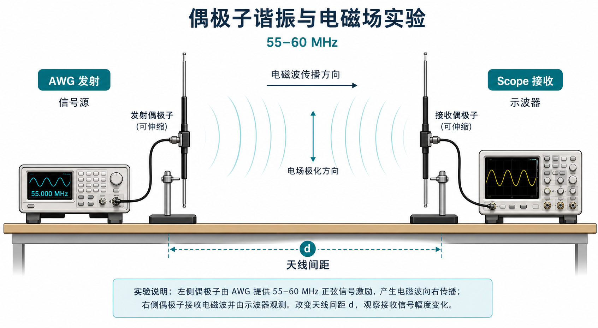
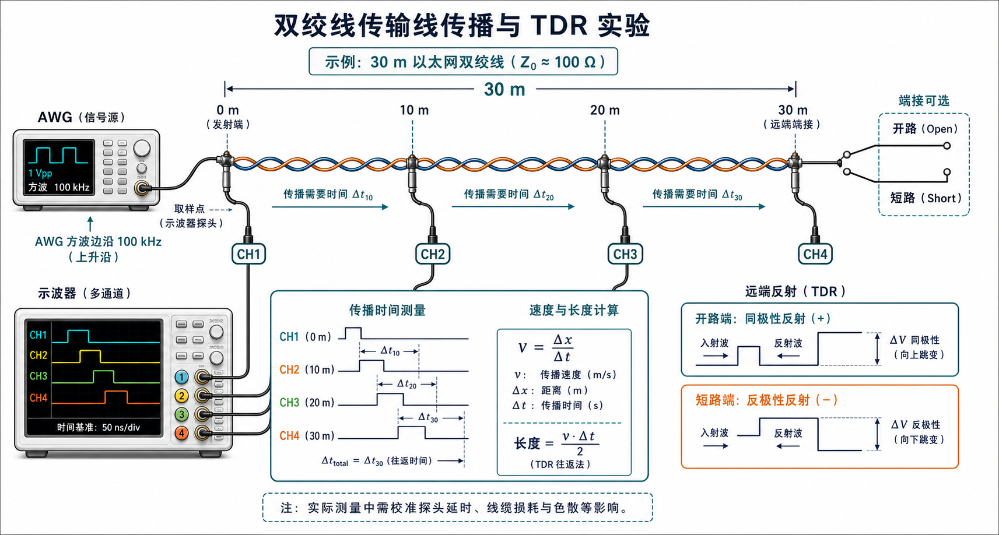
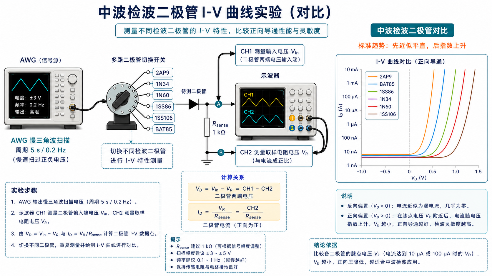

# ai-instruments

用 **UNI-T UTG962 信号发生器**、**Siglent SDS824X HD 示波器**、**UNI-T UT61E 万用表** 和 **UNI-T UT612 LCR 电桥**搭建的电磁学自学实验工作台。

项目已经从简单的仪器脚本扩展为一个半自动 Web 实验平台：平台负责仪器预设、采样、分析、拟合、截图和记录；移动线圈/天线、插拔铁芯、切换二极管、改变接线等步骤由界面引导手动完成。

## 当前能力

- Web 实验工作台：`http://localhost:8052/`
- 仪器控制面板：`http://localhost:8052/panel.html`
- 实验记录页：`http://localhost:8052/records.html`
- AWG/Scope 预设、Scope Auto Set、AWG/Scope 屏幕截图
- Scope 多通道控制与状态刷新
- UT61E 万用表单次读数与串口状态显示，用于低速/DC/基础元件读数
- UT612 LCR 电桥单次读数与 HID 状态显示，用于 L/C/R/Q/ESR/theta 元件标定
- CSV/JSON 本地实验记录导出
- 无数据库，实验记录保存在浏览器 `localStorage`

## 实验主题

| 模块 | 目标 |
|------|------|
| RC/基础交流 | 时间常数、滤波、相位差 |
| 电感电容阻抗 | 用采样电阻和双通道示波器测 C/L/RLC 阻抗、相位和等效参数 |
| 二极管、检波与包络 | 二极管 I-V、整流、RC 平滑、AM 包络检波 |
| 中波 LC 谐振 | 22.5 cm 28 匝环形天线、80 cm 蛛网天线、可变电容、Q、带宽、选择性 |
| 线圈与磁耦合 | 原副边教学线圈、可插拔铁芯、互感、变压器作用 |
| 脉冲与传输线 | 网线双绞线传播时间、TDR、开路/短路反射、速度因子 |
| 偶极子谐振与电磁场 | 1.25 m 单边偶极子在 55-60 MHz 附近的发送/接收、极化、场强变化 |

## 实验图例

这些图片已集成到实验详情页，点击图片可以放大查看。

### 中波 LC 接收天线对比

同一标准场强下比较 22.5 cm、28 匝、0.8 mm 无氧铜漆包线环形天线与 80 cm 多股利兹线蛛网天线的感应电压、Q 和调谐表现。



### 原副边教学线圈

用于互感、铁芯插拔、变压器负载作用和相位关系实验。



### 偶极子发送与接收

两根 1.25 m 单边伸缩偶极子在 55-60 MHz 附近做半波谐振、距离衰减和极化实验。



### 双绞线传播与 TDR

用 AWG 方波边沿观察 30-100 m 网线双绞线的传播延迟、开路/短路反射和速度因子。这里的 `100 kHz` 是方波重复频率，用于避免反射与下一次边沿重叠；真正用于 TDR 的是边沿。



### 检波二极管 I-V 对比

通过多路切换开关比较 `2AP9`、`1N34`、`1N60`、`1SS86`、`1SS106`、`BAT85` 等中波检波二极管。标准趋势是反向/小正向近似平直，过拐点后指数上升。



## 设备

| Key | 设备 | 资源串 |
|-----|------|--------|
| `awg` | UNI-T UTG962 | `USB0::0x6656::0x0834::1021472514::INSTR` |
| `scope` | Siglent SDS824X HD | `USB0::0xF4EC::0x1017::SDS08A0C801504::INSTR` |
| `dmm` | UNI-T UT61E | 光电串口，默认从 `UT61E_PORT` 环境变量读取 |
| `lcr` | UNI-T UT612 | CP2110 HID USB-to-UART，VID/PID `10c4:ea80` |

AWG 和 Scope 是 USBTMC，用 `pyvisa-py + libusb` 控制，**无需 NI-VISA**。UT61E 通过串口读取，参数为 `19200 bps / 7 data bits / odd parity / 1 stop bit`，`DTR=1`、`RTS=0`。UT612 不是普通串口，它通过 Silicon Labs CP2110 HID 桥接芯片读取，Python 侧使用 `hidapi`。

## 安装

```bash
python3.14 -m venv .venv
source .venv/bin/activate
pip install -r requirements.txt
```

依赖包括 `pyvisa`、`pyvisa-py`、`pyusb`、`libusb`、`pyserial`、`hidapi`、`numpy`、`matplotlib`、`Pillow` 等。

## 启动 Web 工作台

默认端口是 `8050`：

```bash
source .venv/bin/activate
python -m experiments.web_server
```

如果要使用当前常用端口 `8052`：

```bash
source .venv/bin/activate
python -c 'from experiments.web_server import main; main(8052)'
```

打开：

- 工作台：`http://localhost:8052/`
- 仪器面板：`http://localhost:8052/panel.html`
- 实验记录：`http://localhost:8052/records.html`

如果修改了 `experiments/profiles.py`，需要重启 Web 服务，因为实验配置是 Python 模块加载进内存的。

## CLI 用法

激活环境后：

```bash
# AWG: 写命令
python -m instruments.cli awg sine --freq 1k --amp 2 --out
python -m instruments.cli awg off

# Scope
python -m instruments.cli scope setup -c 1 --vdiv 500m --tdiv 1m --coupling DC
python -m instruments.cli scope stats -c 1
python -m instruments.cli scope screenshot --path out.png
python -m instruments.cli scope waveform --path wave.csv -c 1

# UT61E DMM
export UT61E_PORT=/dev/tty.usbserial-xxxx
python -m instruments.cli dmm status
python -m instruments.cli dmm read
python -m instruments.cli dmm monitor --interval 1

# UT612 LCR
python -m instruments.cli lcr status
python -m instruments.cli lcr read
python -m instruments.cli lcr monitor --dedupe

# 中波 LC 扫频测 Q
python -m experiments.cli q-measure --f-start 535k --f-stop 1605k \
    --amp 1 --vdiv 500m --load 50 --fine 50 -o output/q.png
```

数值支持 SI 后缀：`k`/`M`/`G` 用于频率，`m`/`u`/`n`/`p` 用于电压、电容、时间等。

## Python 库调用

```python
from instruments import awg, dmm, lcr, scope
from experiments.q_measure import measure_q

awg.configure(1, wave="sine", frequency=1e6, amplitude=2, load=10000, output=True)
stats = scope.waveform_stats(1)
img = scope.screenshot("PNG")
reading = dmm.read_once()
lcr_reading = lcr.read_once()

result = measure_q(
    f_start=535e3,
    f_stop=1605e3,
    fine_points=50,
    amplitude_vpp=1,
    load_ohm=50,
)
print(f"f0 = {result.f0/1e3:.1f} kHz, Q = {result.q:.1f}")
```

## 重要仪器约束

- **AWG 只写不查**：UTG962 的 USBTMC 查询不稳定，业务路径不查询 AWG。`awg.screenshot()` 是单独处理的例外。
- **Scope 电压类 SCPI 测量会超时**：`VPP/VRMS` 等幅度从 `get_waveform()` 波形数据自算。
- **波形换算使用 PREAMBLE**：按 `V = int8(code) × (vdiv / code_per_div) - vdiv_offs` 换算，不硬编码比例。
- **读波形会让示波器进入 STOP**：`get_waveform()` 内部会恢复 RUN，调用者一般无需额外处理。
- **截图读取较慢**：SDS 和 AWG 截图都需要循环读完整图像数据，Web 上将“应用仪器预设”和“抓取屏幕”分开执行。
- **TDR 的关键不是重复频率**：AWG 方波重复频率默认 `100 kHz`，用于让反射不和下一次边沿重叠；可分辨性主要取决于上升沿、线长和示波器时基。
- **UT61E 是慢速读数仪表**：适合电阻、直流电压、二极管压降、电容等基础量的辅助确认；高速波形、相位、Q、TDR 仍由示波器完成。
- **UT612 是 LCR 标定仪表**：适合在线圈、可变电容、蛛网天线材料实验前测 L/C/R/ESR/Q/D/theta；它使用 HID，不会稳定表现为 `/dev/tty.*`。

## 目录结构

```text
instruments/                 # 纯仪器驱动层
  _backend.py                 # USBTMC 会话管理
  awg.py                      # UTG962 写命令与截图
  scope.py                    # SDS824X HD 控制、波形、截图
  dmm.py                      # UT61E 串口读数解析
  lcr.py                      # UT612 CP2110 HID LCR 读数解析
  cli.py                      # awg/scope/dmm/lcr CLI

experiments/                 # 实验应用层
  profiles.py                 # 材料与实验配置
  analysis.py                 # Q、TDR、阻抗、耦合等分析
  q_measure.py                # 扫频法测 Q
  diode_va.py                 # 二极管 I-V 采集分析
  web_server.py               # Web API 与静态资源服务
  static/                     # 工作台前端与图片资源

tests/                       # 单元测试与 API/前端契约测试
```

## 测试

```bash
source .venv/bin/activate
python -m unittest tests.test_experiment_workbench
python -m compileall instruments experiments tests

python3 - <<'PY'
from pathlib import Path
Path('/tmp/workbench.js').write_text(Path('experiments/static/workbench.js').read_text(encoding='utf-8'), encoding='utf-8')
html = Path('experiments/static/panel.html').read_text(encoding='utf-8')
Path('/tmp/panel.html.js').write_text(html.split('<script>', 1)[1].split('</script>', 1)[0], encoding='utf-8')
PY
node --check /tmp/workbench.js
node --check /tmp/panel.html.js
```

更多仪器细节见 [AGENTS.md](AGENTS.md) 和 `.agents/skills/instruments/SKILL.md`。
